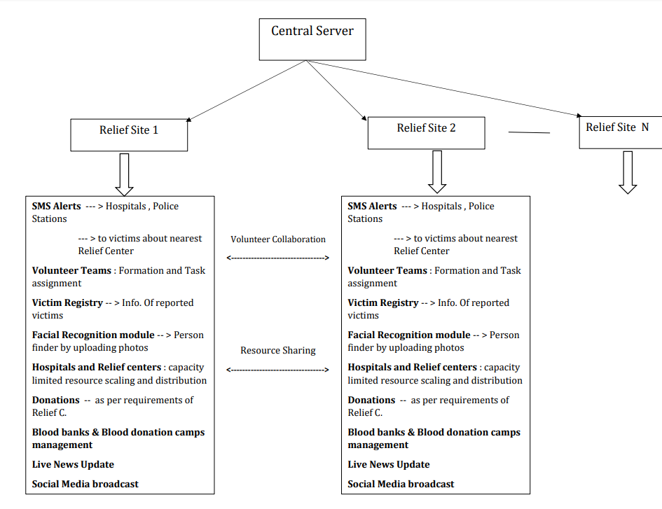

# Allied-Disaster-Relief-Management

## 1.Information Alerts
*	Alerts to Police Station/Healthcare Center/Relief Centre including information such as hotspots where immediate help is required.
*	Alerts to affected and probably affected people including information regarding nearest Rescue Center/Relief Camp.
## 2.Coordinative Volunteer Management
*	Suggestions to volunteer organizations to set relief camps and proper distribution of volunteers.
*	This will increase efficiency of volunteers by reducing time spent on travel and coordination.
##Victim Registry and Finder
*	At each Rescue Center/Relief Camp information of victims including photos will be taken and stored on centralized server. This indicates that relief is provided to victim.
*	Family members of victim can search victim by simply uploading photo using Facial Recognition.
## 4.Hospital and Relief Centre Management
*	Monitoring capacity and utilization of hospitals and relief centers.
*	Efficient distributions of resources according to the requirement.
## 5.Donation
*	Eliminating the problem wherein people often donate unnecessary things. Determining need at each of the relief centers and taking donation accordingly. This will solve logistical problems faced.
*	Increasing the transparency that their donation reaches the needy. 
*	People wishing to donate can directly order through amazon and track it reaching to the relief camp.
*	Some of the volunteers will be assigned to contact Blood Banks and provide it to relief centers.
## 6.Live Updates and Social Media Broadcast
*	Automatic Social Media post generation based on the data collected. This will help to seek more and more help and volunteers from all over the country.
*	Automatic Live Update will keep everyone updated as well motivate current working organizations.

## System Diagram

 
